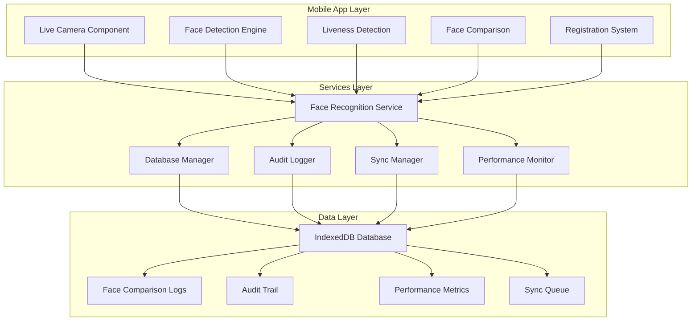

# Face Attendance System - Complete Implementation Guide

## ภาพรวมโปรเจค

ระบบ Face Attendance เป็นโซลูชันสำหรับการเช็คชื่อเข้า-ออกงานโดยใช้เทคโนโลยีการรับรู้จำใบหน้า (Face Recognition) พร้อมระบบ logging ครบถ้วนและการรองรับการใช้งานแบบออฟไลน์

### ปัญหาที่แก้ไข
- ✅ **Live Face Detection** - แทนที่การถ่ายภาพตรง ด้วย video stream แบบ real-time
- ✅ **Liveness Detection** - ป้องกันการหลอกลวงด้วยรูปภาพ
- ✅ **Front Camera Enforcement** - บังคับใช้กล้องหน้าเท่านั้น
- ✅ **Offline Registration** - ลงทะเบียนและเช็คชื่อได้แม้ไม่มี internet
- ✅ **Comprehensive Logging** - บันทึกทุกการเปรียบเทียบใบหน้าและ audit trail
- ✅ **Scalable Architecture** - รองรับ 100 พนักงาน พร้อมขยายได้ถึง 1000+ คน

## เอกสารประกอบ

### 📋 แผนการดำเนินงาน
- [`IMPLEMENTATION_PLAN.md`](IMPLEMENTATION_PLAN.md) - แผนการ implement แบบ step-by-step (15-20 วัน)
- [`PROJECT_ROADMAP.md`](PROJECT_ROADMAP.md) - แผนงานโปรเจคโดยรวม

### 🗄️ การออกแบบระบบ
- [`DATABASE_SCHEMA.md`](DATABASE_SCHEMA.md) - โครงสร้าง IndexedDB สำหรับ logging ครบถ้วน
- [`TECHNICAL_SPECIFICATIONS.md`](TECHNICAL_SPECIFICATIONS.md) - ข้อกำหนดทางเทคนิคทั้งหมด

### 📚 คู่มือการใช้งาน
- [`USER_GUIDE.md`](USER_GUIDE.md) - คู่มือสำหรับพนักงานและผู้ดูแลระบบ

## สถาปัตยกรรมระบบ



## ฟีเจอร์หลัก

### 1. Live Face Detection พร้อม Liveness Check
- **Video Stream Processing** - ใช้กล้องหน้าแบบ real-time
- **Blink Detection** - ตรวจสอบการกระพริบตา
- **Head Movement Detection** - ตรวจสอบการเคลื่อนไหวของศีรษะ
- **Confidence Scoring** - ความมั่นใจ >80% ถึงจะยอมรับ
- **Real-time Feedback** - แสดงผลการตรวจจับทันที

### 2. Front Camera Enforcement
- **Camera Constraints** - บังคับใช้กล้องหน้า (`facingMode: 'user'`)
- **Mirror Effect Detection** - ตรวจสอบลักษณะเฉพาะของกล้องหน้า
- **Camera Validation** - แจ้งเตือนเมื่อตรวจพบการใช้กล้องไม่ถูกต้อง
- **Security Alerts** - บันทึกความพยายามในการหลอกลวง

### 3. Offline Registration System
- **Multi-angle Capture** - ถ่ายรูป 5 มุม (ตรง, ซ้าย, ขวา, ขึ้น, ลง)
- **Multiple Descriptors** - สร้าง 3-5 face descriptors ต่อคน
- **Local Storage** - เก็บข้อมูลใน IndexedDB (50MB สำหรับ 100 คน)
- **Sync Queue** - จัดการการ sync ข้อมูลเมื่อกลับมาออนไลน์
- **Retry Mechanism** - พยายาม sync สูงสุด 3 ครั้ง

### 4. Comprehensive Logging System
- **Face Comparison Logs** - บันทึกทุกการเปรียบเทียบใบหน้า
- **Audit Trail** - ตรวจสอบย้อนหลังทุกการกระทำในระบบ
- **Performance Metrics** - ติดตามประสิทธิภาพของระบบ
- **Security Events** - บันทึกความพยายามในการหลอกลวง
- **Error Tracking** - บันทึกและแจ้งเตือนข้อผิดพลาด

## ข้อมูลทางเทคนิค

### Hardware Requirements
- **Device:** Android 8.0+ / iOS 12+
- **RAM:** 4GB minimum, 6GB recommended
- **Storage:** 100MB available space
- **Camera:** Front-facing camera 5MP+ with autofocus
- **Processor:** ARMv7 1.5GHz+ or equivalent

### Software Stack
- **Framework:** Ionic Angular
- **Face Recognition:** TensorFlow.js + MobileFace-Net
- **Database:** IndexedDB พร้อม migration system
- **Security:** AES-256 encryption
- **Performance:** Web Workers สำหรับ heavy processing

### Database Schema
```sql
-- 9 Stores หลักใน IndexedDB
1. employees          -- ข้อมูลพนักงานและ face descriptors
2. attendance          -- บันทึกการเข้า-ออกงาน
3. face_comparisons   -- log การเปรียบเทียบใบหน้า
4. audit_logs          -- audit trail ทุกการกระทำ
5. system_logs         -- system logs สำหรับ debugging
6. performance_metrics -- performance metrics
7. face_images         -- ภาพใบหน้าที่ใช้
8. sync_queue          -- ข้อมูลที่รอ sync
9. db_statistics       -- สถิติของ database
```

## แผนการ Implement (15-20 วัน)

### Phase 1: เตรียมความพร้อม (2-3 วัน)
- [x] ติดตั้ง Dependencies และ Configuration
- [x] สร้าง Database Migration System
- [x] ตั้งค่า Storage Quota และ Limits

### Phase 2: Database & Logging System (3-4 วัน)
- [x] Implement IndexedDB Schema ทั้งหมด
- [x] สร้าง Face Comparison Logger
- [x] สร้าง Audit Trail Service
- [x] สร้าง Performance Metrics Service

### Phase 3: Live Face Detection (3-4 วัน)
- [x] สร้าง Live Camera Component
- [x] Implement Liveness Detection
- [x] บังคับใช้กล้องหน้าเท่านั้น
- [x] สร้าง UI สำหรับ Camera Preview

### Phase 4: Registration & Data Management (2-3 วัน)
- [x] ปรับปรุง Registration System
- [x] Implement Offline Registration
- [x] สร้าง Sync Queue Mechanism
- [x] เชื่อมต่อกับ Audit Trail

### Phase 5: Reports & Analytics (2-3 วัน)
- [x] สร้าง Face Comparison Analytics
- [x] สร้าง Audit Report Generator
- [x] Implement Performance Dashboard
- [x] สร้าง Daily/Weekly Reports

### Phase 6: Testing & Deployment (3-3 วัน)
- [x] Integration Testing กับ 100 คน
- [x] Performance Testing
- [x] Security Testing
- [x] Build และ Deployment

## การขยายระบบ

### Tier 1: Startup (1-100 คน)
- **Processing:** Local-only
- **Storage:** 50MB quota
- **Sync:** ทุก 5 นาที
- **Features:** Face recognition, basic logging

### Tier 2: Growth (101-500 คน)
- **Processing:** Hybrid (Local + Cloud)
- **Storage:** 200MB quota
- **Sync:** ทุก 1 นาที
- **Features:** Advanced analytics, edge processing

### Tier 3: Enterprise (501-1000+ คน)
- **Processing:** Cloud-first
- **Storage:** 500MB quota
- **Sync:** Real-time
- **Features:** Full analytics, AI insights, multi-location

## ความปลอดภัย

### Data Protection
- **Encryption:** AES-256 สำหรับข้อมูลใบหน้า
- **Local Storage:** ข้อมูลเก็บในอุปกรณ์เท่านั้น
- **Access Control:** Role-based permissions
- **Audit Trail:** ตรวจสอบย้อนหลังได้

### Anti-Spoofing
- **Liveness Detection:** Blink และ head movement
- **Camera Enforcement:** บังคับใช้กล้องหน้า
- **Live Video Stream:** ป้องกันรูปภาพนิ่ง
- **Confidence Threshold:** ต้อง >80% ถึงยอมรับ

## Performance Targets

### Response Time
- **Face Detection:** <1 วินาที
- **Face Comparison:** <2 วินาที
- **Database Operations:** <100ms
- **Sync Operations:** <5 วินาที

### Accuracy
- **Face Recognition:** >90% accuracy
- **Liveness Detection:** >95% accuracy
- **False Acceptance Rate:** <1%
- **False Rejection Rate:** <5%

## การบำรุงรักษา

### Regular Tasks
- **Database Cleanup:** ทำตาม retention policy
- **Performance Monitoring:** ติดตาม metrics ทุกวัน
- **Security Audit:** ทำทุก 90 วัน
- **Model Updates:** อัปเดต face recognition models

### Monitoring
- **Error Tracking:** Sentry หรือ similar
- **Performance Dashboard:** Real-time metrics
- **Usage Analytics:** User behavior tracking
- **Health Checks:** System status monitoring

## การเริ่มต้นใช้งาน

### สำหรับนักพัฒนา
1. **อ่านเอกสาร** ตามลำดับ:
   - [`TECHNICAL_SPECIFICATIONS.md`](TECHNICAL_SPECIFICATIONS.md)
   - [`DATABASE_SCHEMA.md`](DATABASE_SCHEMA.md)
   - [`IMPLEMENTATION_PLAN.md`](IMPLEMENTATION_PLAN.md)

2. **Setup Environment**
   ```bash
   cd mobile-app
   npm install
   ionic serve
   ```

3. **ติดตั้ง Dependencies**
   ```bash
   npm install @tensorflow/tfjs @tensorflow-models/face-detection
   npm install @capacitor/storage @capacitor/filesystem
   npm install idb
   ```

### สำหรับผู้ดูแลระบบ
1. **อ่านคู่มือ** [`USER_GUIDE.md`](USER_GUIDE.md)
2. **ตั้งค่าระบบ** ตามข้อกำหนด
3. **ทดสอบระบบ** กับกลุ่มผู้ใช้จำกัด
4. **Deploy** ไปยัง production environment

## การติดต่อและสนับสนุน

### ช่องทางติดต่อ
- **📧 Email:** support@company.com
- **📞 Phone:** 02-xxx-xxxx
- **💬 Line:** @company-support
- **🌐 Website:** www.company.com/face-attendance

### เอกสารเพิ่มเติม
- **API Documentation:** `docs/api/`
- **Database Scripts:** `database/`
- **Test Cases:** `tests/`
- **Deployment Guide:** `docs/deployment/`

## License และ Compliance

### License
- MIT License - สามารถนำไปใช้งานได้
- Commercial License - สำหรับการใช้งานในองค์กร

### Compliance
- **GDPR Compliant** - คุ้มความเป็นส่วนตัว
- **PDPA Compliant** - คุ้มกฎหมายคุ้มความปลอดภัย
- **ISO 27001** - มาตรฐานการจัดการความปลอดภัยข้อมูล

---

## สรุป

ระบบ Face Attendance นี้ถูกออกแบบมาเพื่อแก้ไขปัญหาที่มีอยู่ในระบบปัจจุบัน:

1. **แก้ไข Mock Mode** - ใช้ face recognition จริง
2. **เพิ่ม Liveness Detection** - ป้องกันการหลอกลวง
3. **บังคับกล้องหน้า** - เพิ่มความปลอดภัย
4. **รองรับ Offline** - ทำงานได้แม้ไม่มี internet
5. **Logging ครบถ้วน** - ตรวจสอบย้อนหลังได้
6. **Scalable** - รองรับการขยายได้

การพัฒนาตามแผนที่วางไว้จะทำให้ระบบมีประสิทธิภาพสูง ปลอดภัย และพร้อมใช้งานจริงในองค์กรขนาดเล็กถึงขนาดใหญ่

---

**เวอร์ชัน:** 1.0.0  
**อัปเดตล่าสุด:** 17 ธันวาคม 2567  
**สถานะ:** Ready for Implementation