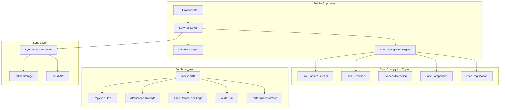

# Technical Specifications - Face Attendance System

## ภาพรวม

เอกสารนี้รวบรวมข้อกำหนดทางเทคนิคสำหรับระบบ Face Attendance ที่รองรับ 100 พนักงาน พร้อมระบบ logging ครบถ้วน

## System Requirements

### Hardware Requirements

#### Minimum Requirements
- **Device:** Android 8.0+ / iOS 12+
- **RAM:** 4GB minimum
- **Storage:** 100MB available space
- **Camera:** Front-facing camera 5MP+ with autofocus
- **Processor:** ARMv7 1.5GHz+ or equivalent

#### Recommended Requirements
- **Device:** Android 10+ / iOS 14+
- **RAM:** 6GB+ recommended
- **Storage:** 500MB available space
- **Camera:** Front-facing camera 8MP+ with autofocus and flash
- **Processor:** ARMv8 2.0GHz+ or equivalent

### Software Requirements

#### Dependencies
```json
{
  "core": {
    "@angular/core": "^18.0.0",
    "@ionic/angular": "^8.0.0",
    "@capacitor/core": "^8.0.0"
  },
  "faceRecognition": {
    "@tensorflow/tfjs": "^4.0.0",
    "@tensorflow-models/face-detection": "^1.0.0",
    "@tensorflow-models/face-landmarks-detection": "^1.0.0"
  },
  "storage": {
    "@capacitor/storage": "^8.0.0",
    "@capacitor/filesystem": "^8.0.0",
    "idb": "^7.0.0"
  },
  "camera": {
    "@capacitor/camera": "^8.0.0"
  },
  "geolocation": {
    "@capacitor/geolocation": "^8.0.0"
  }
}
```

## Architecture Overview

### System Architecture Diagram



### Component Architecture

#### 1. UI Components
```typescript
// Core Components
export const CORE_COMPONENTS = {
  LIVE_CAMERA: 'LiveCameraComponent',
  REGISTRATION_FORM: 'RegistrationFormComponent',
  ATTENDANCE_DASHBOARD: 'AttendanceDashboardComponent',
  REPORTS_VIEWER: 'ReportsViewerComponent',
  SETTINGS_PANEL: 'SettingsPanelComponent'
};

// Feature Components
export const FEATURE_COMPONENTS = {
  FACE_OVERLAY: 'FaceOverlayComponent',
  CONFIDENCE_INDICATOR: 'ConfidenceIndicatorComponent',
  LIVENESS_CHALLENGE: 'LivenessChallengeComponent',
  SYNC_STATUS: 'SyncStatusComponent',
  ERROR_DISPLAY: 'ErrorDisplayComponent'
};
```

#### 2. Services Layer
```typescript
// Core Services
export const CORE_SERVICES = {
  FACE_DETECTION: 'FaceDetectionService',
  ATTENDANCE_MANAGER: 'AttendanceManagerService',
  DATABASE_MANAGER: 'DatabaseManagerService',
  SYNC_MANAGER: 'SyncManagerService'
};

// Supporting Services
export const SUPPORTING_SERVICES = {
  AUDIT_LOGGER: 'AuditLoggerService',
  PERFORMANCE_MONITOR: 'PerformanceMonitorService',
  ENCRYPTION_SERVICE: 'EncryptionService',
  NOTIFICATION_SERVICE: 'NotificationService'
};
```

## Face Recognition Engine

### 1. Live Face Detection

#### Camera Configuration
```typescript
interface CameraConfiguration {
  facingMode: 'user';           // Front camera only
  width: { ideal: 640, max: 1280 };
  height: { ideal: 480, max: 720 };
  frameRate: { ideal: 30, max: 60 };
  autoFocus: true;
  flash: 'auto';
}

// Camera constraints
const CAMERA_CONSTRAINTS: MediaStreamConstraints = {
  video: {
    facingMode: 'user',
    width: { ideal: 640, max: 1280 },
    height: { ideal: 480, max: 720 },
    frameRate: { ideal: 30 }
  },
  audio: false
};
```

#### Face Detection Model
```typescript
// Model Configuration
const FACE_DETECTION_CONFIG = {
  model: 'MediaPipeFaceDetection',
  runtime: 'tfjs',
  maxFaces: 1,              // ตรวจจับใบหน้าคนเดียว
  refineLandmarks: true,
  minDetectionConfidence: 0.5,
  minPresenceConfidence: 0.5
};

// Model Loading
async function loadFaceDetectionModel(): Promise<any> {
  const model = await faceDetection.createDetector(
    FACE_DETECTION_CONFIG.model,
    {
      runtime: FACE_DETECTION_CONFIG.runtime,
      maxFaces: FACE_DETECTION_CONFIG.maxFaces,
      refineLandmarks: FACE_DETECTION_CONFIG.refineLandmarks
    }
  );
  
  return model;
}
```

### 2. Liveness Detection

#### Blink Detection Algorithm
```typescript
interface BlinkDetectionConfig {
  EYE_ASPECT_RATIO_THRESHOLD = 0.25;
  CONSECUTIVE_FRAMES_THRESHOLD = 3;
  BLINK_DURATION_MIN = 100;    // ms
  BLINK_DURATION_MAX = 400;    // ms
}

class BlinkDetector {
  private eyeAspectRatioHistory: number[] = [];
  private isBlinking = false;
  private blinkStartTime = 0;
  
  detectBlink(landmarks: any[]): boolean {
    const leftEye = this.extractEyeLandmarks(landmarks, 'left');
    const rightEye = this.extractEyeLandmarks(landmarks, 'right');
    
    const leftEAR = this.calculateEyeAspectRatio(leftEye);
    const rightEAR = this.calculateEyeAspectRatio(rightEye);
    const averageEAR = (leftEAR + rightEAR) / 2;
    
    this.eyeAspectRatioHistory.push(averageEAR);
    
    if (this.eyeAspectRatioHistory.length > 5) {
      this.eyeAspectRatioHistory.shift();
    }
    
    return this.analyzeBlinkPattern(averageEAR);
  }
  
  private calculateEyeAspectRatio(eyeLandmarks: any[]): number {
    // คำนวณ Eye Aspect Ratio (EAR)
    const vertical1 = this.distance(eyeLandmarks[1], eyeLandmarks[5]);
    const vertical2 = this.distance(eyeLandmarks[2], eyeLandmarks[4]);
    const horizontal = this.distance(eyeLandmarks[0], eyeLandmarks[3]);
    
    return (vertical1 + vertical2) / (2 * horizontal);
  }
  
  private analyzeBlinkPattern(currentEAR: number): boolean {
    if (currentEAR < BLINK_DETECTION_CONFIG.EYE_ASPECT_RATIO_THRESHOLD) {
      if (!this.isBlinking) {
        this.isBlinking = true;
        this.blinkStartTime = Date.now();
      }
    } else {
      if (this.isBlinking) {
        const blinkDuration = Date.now() - this.blinkStartTime;
        this.isBlinking = false;
        
        return BLINK_DETECTION_CONFIG.BLINK_DURATION_MIN <= blinkDuration &&
               blinkDuration <= BLINK_DETECTION_CONFIG.BLINK_DURATION_MAX;
      }
    }
    
    return false;
  }
}
```

#### Head Movement Detection
```typescript
interface HeadMovementConfig {
  MOVEMENT_THRESHOLD = 0.05;    // 5% movement
  DIRECTION_CHANGE_THRESHOLD = 3;  // 3 direction changes
  TIME_WINDOW = 2000;            // 2 seconds
}

class HeadMovementDetector {
  private positionHistory: Array<{x: number, y: number, timestamp: number}> = [];
  private directionChanges = 0;
  private lastDirection = null;
  
  detectHeadMovement(faceBox: any): boolean {
    const currentPosition = {
      x: faceBox.x + faceBox.width / 2,
      y: faceBox.y + faceBox.height / 2,
      timestamp: Date.now()
    };
    
    this.positionHistory.push(currentPosition);
    
    // เก็บข้อมูลย้อนหลัง 2 วินาที
    const cutoffTime = Date.now() - HEAD_MOVEMENT_CONFIG.TIME_WINDOW;
    this.positionHistory = this.positionHistory.filter(pos => pos.timestamp > cutoffTime);
    
    if (this.positionHistory.length < 2) {
      return false;
    }
    
    return this.analyzeMovementPattern();
  }
  
  private analyzeMovementPattern(): boolean {
    const movements = this.calculateMovements();
    const significantMovements = movements.filter(m => 
      Math.abs(m) > HEAD_MOVEMENT_CONFIG.MOVEMENT_THRESHOLD
    );
    
    return significantMovements.length >= 2;
  }
  
  private calculateMovements(): number[] {
    const movements = [];
    
    for (let i = 1; i < this.positionHistory.length; i++) {
      const prev = this.positionHistory[i - 1];
      const curr = this.positionHistory[i];
      
      const deltaX = (curr.x - prev.x) / prev.x;
      const deltaY = (curr.y - prev.y) / prev.y;
      const totalMovement = Math.sqrt(deltaX * deltaX + deltaY * deltaY);
      
      movements.push(totalMovement);
    }
    
    return movements;
  }
}
```

### 3. Face Comparison Algorithm

#### Face Descriptor Extraction
```typescript
interface FaceDescriptorConfig {
  DESCRIPTOR_SIZE = 128;        // Face-Net standard
  MIN_FACE_SIZE = 64;          // pixels
  MAX_FACE_SIZE = 512;         // pixels
  CONFIDENCE_THRESHOLD = 0.8;   // 80%
}

class FaceDescriptorExtractor {
  private model: any;
  
  async initialize(): Promise<void> {
    // โหลด Face-Net หรือ MobileFace-Net model
    this.model = await tf.loadLayersModel('/models/facenet/model.json');
  }
  
  async extractDescriptor(imageData: ImageData, faceBox: any): Promise<number[]> {
    // ครอปใบหน้าจากภาพ
    const faceImage = this.cropFace(imageData, faceBox);
    
    // ปรับขนาดใบหน้า
    const resizedImage = tf.image.resizeBilinear(faceImage, [160, 160]);
    
    // Normalize ภาพ
    const normalizedImage = this.normalizeImage(resizedImage);
    
    // สร้าง batch dimension
    const batchedImage = normalizedImage.expandDims(0);
    
    // สกัด face descriptor
    const descriptor = await this.model.predict(batchedImage) as tf.Tensor;
    
    // แปลงเป็น array
    const descriptorArray = await descriptor.data();
    
    // Cleanup tensors
    faceImage.dispose();
    resizedImage.dispose();
    normalizedImage.dispose();
    batchedImage.dispose();
    descriptor.dispose();
    
    return Array.from(descriptorArray);
  }
  
  private normalizeImage(image: tf.Tensor): tf.Tensor {
    return image.div(255.0).sub(0.5).mul(2.0);
  }
  
  private cropFace(imageData: ImageData, faceBox: any): tf.Tensor {
    // ครอปใบหน้าตาม bounding box
    return tf.browser.fromPixels(imageData)
      .slice([faceBox.y, faceBox.x, 0], [faceBox.height, faceBox.width, 3]);
  }
}
```

#### Face Similarity Calculation
```typescript
class FaceSimilarityCalculator {
  private readonly SIMILARITY_THRESHOLD = 0.8;
  
  calculateSimilarity(descriptor1: number[], descriptor2: number[]): number {
    // ใช้ Cosine Similarity สำหรับ performance ที่ดีกว่า Euclidean distance
    
    if (descriptor1.length !== descriptor2.length) {
      throw new Error('Descriptor sizes must match');
    }
    
    let dotProduct = 0;
    let norm1 = 0;
    let norm2 = 0;
    
    for (let i = 0; i < descriptor1.length; i++) {
      dotProduct += descriptor1[i] * descriptor2[i];
      norm1 += descriptor1[i] * descriptor1[i];
      norm2 += descriptor2[i] * descriptor2[i];
    }
    
    norm1 = Math.sqrt(norm1);
    norm2 = Math.sqrt(norm2);
    
    if (norm1 === 0 || norm2 === 0) {
      return 0;
    }
    
    return dotProduct / (norm1 * norm2);
  }
  
  isMatch(similarity: number): boolean {
    return similarity >= this.SIMILARITY_THRESHOLD;
  }
  
  findBestMatch(targetDescriptor: number[], candidateDescriptors: number[][]): {
    bestMatch: number[];
    similarity: number;
    index: number;
  } {
    let bestSimilarity = 0;
    let bestIndex = -1;
    
    for (let i = 0; i < candidateDescriptors.length; i++) {
      const similarity = this.calculateSimilarity(targetDescriptor, candidateDescriptors[i]);
      
      if (similarity > bestSimilarity) {
        bestSimilarity = similarity;
        bestIndex = i;
      }
    }
    
    return {
      bestMatch: bestIndex >= 0 ? candidateDescriptors[bestIndex] : [],
      similarity: bestSimilarity,
      index: bestIndex
    };
  }
}
```

## Database Specifications

### IndexedDB Configuration

#### Database Version Management
```typescript
interface DatabaseConfig {
  name: string;
  version: number;
  stores: Record<string, StoreConfig>;
}

interface StoreConfig {
  keyPath?: string;
  autoIncrement?: boolean;
  indexes: Record<string, IndexConfig>;
}

interface IndexConfig {
  keyPath: string | string[];
  unique?: boolean;
  multiEntry?: boolean;
}

const DATABASE_CONFIG: DatabaseConfig = {
  name: 'FaceAttendanceDB',
  version: 4,
  stores: {
    employees: {
      keyPath: 'employeeId',
      autoIncrement: false,
      indexes: {
        name: { keyPath: 'name', unique: false },
        department: { keyPath: 'department', unique: false },
        registrationDate: { keyPath: 'registrationDate', unique: false },
        isActive: { keyPath: 'isActive', unique: false }
      }
    },
    face_comparisons: {
      keyPath: 'id',
      autoIncrement: true,
      indexes: {
        employeeId: { keyPath: 'employeeId', unique: false },
        timestamp: { keyPath: 'timestamp', unique: false },
        date: { keyPath: 'date', unique: false },
        result: { keyPath: 'result', unique: false },
        employeeDate: { keyPath: ['employeeId', 'date'], unique: false },
        resultDate: { keyPath: ['result', 'date'], unique: false }
      }
    }
    // ... other stores
  }
};
```

#### Performance Optimization
```typescript
class DatabaseOptimizer {
  private readonly BATCH_SIZE = 100;
  private readonly MAX_MEMORY_USAGE = 50 * 1024 * 1024; // 50MB
  
  async optimizeDatabase(): Promise<void> {
    // 1. Cleanup old data
    await this.cleanupOldData();
    
    // 2. Rebuild indexes
    await this.rebuildIndexes();
    
    // 3. Update statistics
    await this.updateStatistics();
    
    // 4. Compact database
    await this.compactDatabase();
  }
  
  private async cleanupOldData(): Promise<void> {
    const retentionPolicy = {
      face_comparisons: 90,    // 90 days
      audit_logs: 180,         // 180 days
      system_logs: 30,          // 30 days
      performance_metrics: 30   // 30 days
    };
    
    for (const [store, days] of Object.entries(retentionPolicy)) {
      await this.cleanupStore(store, days);
    }
  }
  
  private async cleanupStore(storeName: string, daysToKeep: number): Promise<void> {
    const cutoffDate = Date.now() - (daysToKeep * 24 * 60 * 60 * 1000);
    
    const db = await this.openDatabase();
    const transaction = db.transaction([storeName], 'readwrite');
    const store = transaction.objectStore(storeName);
    const index = store.index('timestamp');
    
    const range = IDBKeyRange.upperBound(cutoffDate);
    const request = index.openCursor(range);
    
    request.onsuccess = (event) => {
      const cursor = (event.target as IDBRequest).result;
      if (cursor) {
        cursor.delete();
        cursor.continue();
      }
    };
  }
}
```

## Security Specifications

### Data Encryption

#### Encryption Configuration
```typescript
interface EncryptionConfig {
  ALGORITHM: 'AES-GCM';
  KEY_LENGTH: 256;
  IV_LENGTH: 12;
  SALT_LENGTH: 32;
  ITERATIONS: 100000;
}

class DataEncryptionService {
  private readonly config: EncryptionConfig = {
    ALGORITHM: 'AES-GCM',
    KEY_LENGTH: 256,
    IV_LENGTH: 12,
    SALT_LENGTH: 32,
    ITERATIONS: 100000
  };
  
  async encryptData(data: string, password: string): Promise<{
    encrypted: string;
    iv: string;
    salt: string;
  }> {
    // Generate salt
    const salt = crypto.getRandomValues(new Uint8Array(this.config.SALT_LENGTH));
    
    // Derive key
    const key = await this.deriveKey(password, salt);
    
    // Generate IV
    const iv = crypto.getRandomValues(new Uint8Array(this.config.IV_LENGTH));
    
    // Encrypt data
    const encodedData = new TextEncoder().encode(data);
    const encryptedData = await crypto.subtle.encrypt(
      {
        name: this.config.ALGORITHM,
        iv: iv
      },
      key,
      encodedData
    );
    
    return {
      encrypted: this.arrayBufferToBase64(encryptedData),
      iv: this.arrayBufferToBase64(iv),
      salt: this.arrayBufferToBase64(salt)
    };
  }
  
  async decryptData(
    encryptedData: string,
    iv: string,
    salt: string,
    password: string
  ): Promise<string> {
    // Derive key
    const key = await this.deriveKey(password, this.base64ToArrayBuffer(salt));
    
    // Decrypt data
    const decryptedData = await crypto.subtle.decrypt(
      {
        name: this.config.ALGORITHM,
        iv: this.base64ToArrayBuffer(iv)
      },
      key,
      this.base64ToArrayBuffer(encryptedData)
    );
    
    return new TextDecoder().decode(decryptedData);
  }
  
  private async deriveKey(password: string, salt: Uint8Array): Promise<CryptoKey> {
    const encoder = new TextEncoder();
    const keyMaterial = await crypto.subtle.importKey(
      'raw',
      encoder.encode(password),
      'PBKDF2',
      false,
      ['deriveBits', 'deriveKey']
    );
    
    return crypto.subtle.deriveKey(
      {
        name: 'PBKDF2',
        salt: salt,
        iterations: this.config.ITERATIONS,
        hash: 'SHA-256'
      },
      keyMaterial,
      { name: 'AES-GCM', length: this.config.KEY_LENGTH },
      false,
      ['encrypt', 'decrypt']
    );
  }
}
```

### Access Control

#### Role-Based Access Control
```typescript
interface Role {
  name: string;
  permissions: Permission[];
}

interface Permission {
  resource: string;
  actions: string[];
}

const ROLES: Record<string, Role> = {
  EMPLOYEE: {
    name: 'Employee',
    permissions: [
      { resource: 'attendance', actions: ['read', 'create'] },
      { resource: 'profile', actions: ['read', 'update'] }
    ]
  },
  MANAGER: {
    name: 'Manager',
    permissions: [
      { resource: 'attendance', actions: ['read', 'create', 'update'] },
      { resource: 'profile', actions: ['read', 'update'] },
      { resource: 'reports', actions: ['read'] },
      { resource: 'employees', actions: ['read'] }
    ]
  },
  ADMIN: {
    name: 'Administrator',
    permissions: [
      { resource: '*', actions: ['*'] } // All permissions
    ]
  }
};

class AccessControlService {
  hasPermission(userRole: string, resource: string, action: string): boolean {
    const role = ROLES[userRole];
    if (!role) return false;
    
    return role.permissions.some(permission =>
      (permission.resource === resource || permission.resource === '*') &&
      (permission.actions.includes(action) || permission.actions.includes('*'))
    );
  }
  
  getPermissions(userRole: string): Permission[] {
    return ROLES[userRole]?.permissions || [];
  }
}
```

## Performance Specifications

### Performance Targets

#### Response Time Requirements
```typescript
interface PerformanceTargets {
  FACE_DETECTION: {
    MAX_TIME: 1000;        // 1 second
    AVERAGE_TIME: 500;      // 500ms
    SUCCESS_RATE: 0.95;      // 95%
  };
  
  FACE_COMPARISON: {
    MAX_TIME: 2000;        // 2 seconds
    AVERAGE_TIME: 1000;     // 1 second
    SUCCESS_RATE: 0.90;      // 90%
  };
  
  DATABASE_OPERATIONS: {
    MAX_TIME: 100;         // 100ms
    AVERAGE_TIME: 50;       // 50ms
    SUCCESS_RATE: 0.99;      // 99%
  };
  
  SYNC_OPERATIONS: {
    MAX_TIME: 5000;        // 5 seconds
    AVERAGE_TIME: 2000;     // 2 seconds
    SUCCESS_RATE: 0.95;      // 95%
  };
}
```

#### Memory Usage Limits
```typescript
interface MemoryLimits {
  MAX_TOTAL_MEMORY: 100 * 1024 * 1024;  // 100MB
  MAX_FACE_DESCRIPTORS: 100 * 512 * 8;  // 100 employees * 512 dimensions * 8 bytes
  MAX_CACHED_IMAGES: 50 * 1024 * 1024;   // 50MB for cached images
  MAX_DATABASE_SIZE: 50 * 1024 * 1024;     // 50MB for IndexedDB
}

class MemoryManager {
  private memoryUsage = {
    faceDescriptors: 0,
    cachedImages: 0,
    database: 0,
    other: 0
  };
  
  checkMemoryUsage(): boolean {
    const totalUsage = Object.values(this.memoryUsage).reduce((sum, usage) => sum + usage, 0);
    return totalUsage < MemoryLimits.MAX_TOTAL_MEMORY;
  }
  
  async optimizeMemoryUsage(): Promise<void> {
    // 1. Clear old cached images
    await this.clearOldCachedImages();
    
    // 2. Optimize face descriptors
    await this.optimizeFaceDescriptors();
    
    // 3. Compact database
    await this.compactDatabase();
    
    // 4. Force garbage collection if available
    if (window.gc) {
      window.gc();
    }
  }
}
```

### Performance Monitoring

#### Metrics Collection
```typescript
interface PerformanceMetrics {
  operation: string;
  startTime: number;
  endTime: number;
  duration: number;
  success: boolean;
  error?: string;
  metadata?: Record<string, any>;
}

class PerformanceMonitor {
  private metrics: PerformanceMetrics[] = [];
  private readonly MAX_METRICS = 1000;
  
  startOperation(operation: string, metadata?: Record<string, any>): string {
    const operationId = this.generateOperationId();
    const startTime = performance.now();
    
    // Store operation start
    this.metrics.push({
      operation,
      startTime,
      endTime: 0,
      duration: 0,
      success: false,
      metadata
    } as PerformanceMetrics);
    
    return operationId;
  }
  
  endOperation(operationId: string, success: boolean, error?: string): void {
    const metric = this.metrics.find(m => m.startTime === parseInt(operationId));
    if (metric) {
      metric.endTime = performance.now();
      metric.duration = metric.endTime - metric.startTime;
      metric.success = success;
      metric.error = error;
    }
  }
  
  getAverageTime(operation: string): number {
    const operationMetrics = this.metrics.filter(m => m.operation === operation && m.success);
    
    if (operationMetrics.length === 0) return 0;
    
    const totalTime = operationMetrics.reduce((sum, m) => sum + m.duration, 0);
    return totalTime / operationMetrics.length;
  }
  
  getSuccessRate(operation: string): number {
    const operationMetrics = this.metrics.filter(m => m.operation === operation);
    
    if (operationMetrics.length === 0) return 0;
    
    const successCount = operationMetrics.filter(m => m.success).length;
    return successCount / operationMetrics.length;
  }
  
  generateReport(): PerformanceReport {
    const operations = [...new Set(this.metrics.map(m => m.operation))];
    
    return {
      timestamp: Date.now(),
      operations: operations.map(operation => ({
        name: operation,
        averageTime: this.getAverageTime(operation),
        successRate: this.getSuccessRate(operation),
        totalOperations: this.metrics.filter(m => m.operation === operation).length
      })),
      summary: {
        totalOperations: this.metrics.length,
        averageTime: this.metrics.reduce((sum, m) => sum + m.duration, 0) / this.metrics.length,
        overallSuccessRate: this.metrics.filter(m => m.success).length / this.metrics.length
      }
    };
  }
}
```

## Testing Specifications

### Unit Testing

#### Test Coverage Requirements
```typescript
interface TestCoverageRequirements {
  MINIMUM_COVERAGE: 80;           // 80%
  CRITICAL_MODULES: 95;            // 95% for critical modules
  FACE_RECOGNITION: 90;          // 90% for face recognition
  DATABASE_OPERATIONS: 85;        // 85% for database operations
}
```

#### Test Categories
```typescript
// Face Recognition Tests
describe('FaceRecognition', () => {
  describe('FaceDetection', () => {
    it('should detect face in clear image');
    it('should handle multiple faces');
    it('should handle no face scenario');
    it('should work with different lighting conditions');
  });
  
  describe('LivenessDetection', () => {
    it('should detect real blink');
    it('should detect head movement');
    it('should reject photo spoofing');
    it('should work with video spoofing');
  });
  
  describe('FaceComparison', () => {
    it('should match same person with high confidence');
    it('should reject different person');
    it('should handle low quality images');
    it('should work within performance limits');
  });
});

// Database Tests
describe('DatabaseOperations', () => {
  describe('EmployeeData', () => {
    it('should store employee data');
    it('should retrieve employee data');
    it('should update employee data');
    it('should delete employee data');
  });
  
  describe('FaceComparisonLogs', () => {
    it('should log comparison results');
    it('should retrieve logs by date');
    it('should retrieve logs by employee');
    it('should handle large datasets');
  });
});
```

### Integration Testing

#### Test Scenarios
```typescript
interface IntegrationTestScenario {
  name: string;
  description: string;
  steps: TestStep[];
  expectedResult: string;
}

const INTEGRATION_TESTS: IntegrationTestScenario[] = [
  {
    name: 'Complete Attendance Flow',
    description: 'Test complete flow from login to attendance recording',
    steps: [
      { action: 'launch_app', expected: 'app_launches' },
      { action: 'login_user', expected: 'user_authenticated' },
      { action: 'register_face', expected: 'face_registered' },
      { action: 'check_in', expected: 'attendance_recorded' },
      { action: 'check_out', expected: 'attendance_completed' }
    ],
    expectedResult: 'complete_flow_success'
  },
  {
    name: 'Offline Operation',
    description: 'Test app functionality without internet',
    steps: [
      { action: 'disable_network', expected: 'offline_mode' },
      { action: 'register_face', expected: 'face_registered_offline' },
      { action: 'check_in', expected: 'attendance_recorded_offline' },
      { action: 'enable_network', expected: 'data_synced' }
    ],
    expectedResult: 'offline_operation_success'
  }
];
```

## Deployment Specifications

### Build Configuration

#### Android Build
```typescript
// capacitor.config.ts
const androidConfig: CapacitorConfig = {
  appId: 'com.faceattendance.app',
  appName: 'Face Attendance',
  webDir: 'dist',
  server: {
    androidScheme: 'https'
  },
  android: {
    buildOptions: {
      signingType: 'apksigner'
    }
  },
  plugins: {
    Camera: {
      permissions: ['android.permission.CAMERA', 'android.permission.WRITE_EXTERNAL_STORAGE'],
      requestPermissions: true
    },
    Geolocation: {
      permissions: ['android.permission.ACCESS_FINE_LOCATION', 'android.permission.ACCESS_COARSE_LOCATION'],
      requestPermissions: true
    }
  }
};
```

#### iOS Build
```typescript
const iosConfig: CapacitorConfig = {
  // ... same as Android config
  ios: {
    scheme: 'FaceAttendance',
    buildConfiguration: 'Release'
  },
  plugins: {
    Camera: {
      permissions: ['NSCameraUsageDescription', 'NSPhotoLibraryUsageDescription']
    },
    Geolocation: {
      permissions: ['NSLocationWhenInUseUsageDescription']
    }
  }
};
```

### Release Checklist

#### Pre-Release Requirements
```typescript
interface ReleaseChecklist {
  TESTING: {
    UNIT_TESTS_PASSED: boolean;
    INTEGRATION_TESTS_PASSED: boolean;
    PERFORMANCE_TESTS_PASSED: boolean;
    SECURITY_TESTS_PASSED: boolean;
  };
  
  DOCUMENTATION: {
    API_DOCS_UPDATED: boolean;
    USER_GUIDE_UPDATED: boolean;
    RELEASE_NOTES_PREPARED: boolean;
  };
  
  COMPLIANCE: {
    PRIVACY_POLICY_UPDATED: boolean;
    SECURITY_AUDIT_COMPLETED: boolean;
    GDPR_COMPLIANCE_CHECKED: boolean;
  };
  
  DEPLOYMENT: {
    BUILD_SUCCESSFUL: boolean;
    SIGNING_CONFIGURED: boolean;
    STORE_LISTING_PREPARED: boolean;
  };
}
```

## Maintenance Specifications

### Monitoring Requirements

#### Health Checks
```typescript
interface HealthCheck {
  name: string;
  status: 'HEALTHY' | 'WARNING' | 'CRITICAL';
  lastCheck: number;
  details?: any;
}

class SystemHealthMonitor {
  async performHealthChecks(): Promise<HealthCheck[]> {
    const checks: HealthCheck[] = [
      await this.checkDatabaseHealth(),
      await this.checkCameraHealth(),
      await this.checkMemoryUsage(),
      await this.checkStorageSpace(),
      await this.checkPerformanceMetrics()
    ];
    
    return checks;
  }
  
  private async checkDatabaseHealth(): Promise<HealthCheck> {
    try {
      const db = await this.openDatabase();
      const stats = await this.getDatabaseStats();
      
      return {
        name: 'Database',
        status: stats.usage < 0.8 ? 'HEALTHY' : 'WARNING',
        lastCheck: Date.now(),
        details: stats
      };
    } catch (error) {
      return {
        name: 'Database',
        status: 'CRITICAL',
        lastCheck: Date.now(),
        details: { error: error.message }
      };
    }
  }
}
```

### Backup and Recovery

#### Backup Strategy
```typescript
interface BackupConfig {
  FREQUENCY: 'DAILY' | 'WEEKLY' | 'MONTHLY';
  RETENTION: number;           // days
  ENCRYPTION: boolean;
  COMPRESSION: boolean;
  DESTINATION: 'LOCAL' | 'CLOUD' | 'BOTH';
}

const BACKUP_CONFIG: BackupConfig = {
  FREQUENCY: 'DAILY',
  RETENTION: 30,
  ENCRYPTION: true,
  COMPRESSION: true,
  DESTINATION: 'BOTH'
};

class BackupManager {
  async performBackup(): Promise<BackupResult> {
    const backupData = await this.collectBackupData();
    const encryptedBackup = await this.encryptBackup(backupData);
    const compressedBackup = await this.compressBackup(encryptedBackup);
    
    const result: BackupResult = {
      timestamp: Date.now(),
      size: compressedBackup.size,
      checksum: this.calculateChecksum(compressedBackup),
      locations: []
    };
    
    if (BACKUP_CONFIG.DESTINATION === 'LOCAL' || BACKUP_CONFIG.DESTINATION === 'BOTH') {
      result.locations.push(await this.saveLocalBackup(compressedBackup));
    }
    
    if (BACKUP_CONFIG.DESTINATION === 'CLOUD' || BACKUP_CONFIG.DESTINATION === 'BOTH') {
      result.locations.push(await this.saveCloudBackup(compressedBackup));
    }
    
    return result;
  }
}
```

## สรุป

Technical specifications นี้ครอบคลุมทุกด้านของระบบ Face Attendance:

1. **System Requirements** - Hardware และ software ที่จำเป็น
2. **Architecture** - การออกแบบระบบแบบ modular และ scalable
3. **Face Recognition Engine** - Live detection, liveness check, และ comparison algorithms
4. **Database Specifications** - IndexedDB schema และ optimization
5. **Security** - Encryption, access control, และ compliance
6. **Performance** - Targets, monitoring, และ optimization
7. **Testing** - Unit, integration, และ performance testing
8. **Deployment** - Build configuration และ release process
9. **Maintenance** - Monitoring, backup, และ recovery

การ implement ตาม specifications นี้จะทำให้แน่ใจว่าระบบมีความเสถียร ปลอดภัย และ perform ตามที่กำหนด